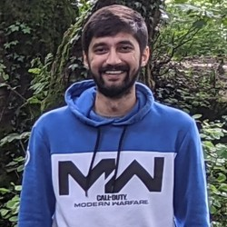
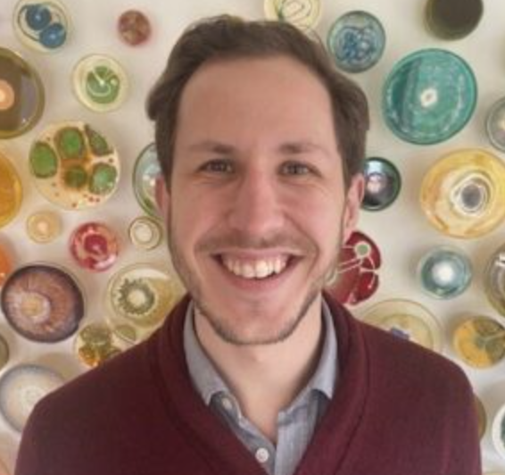
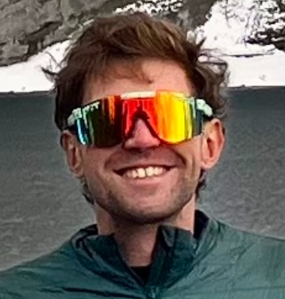
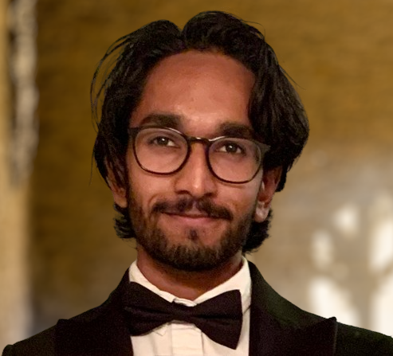
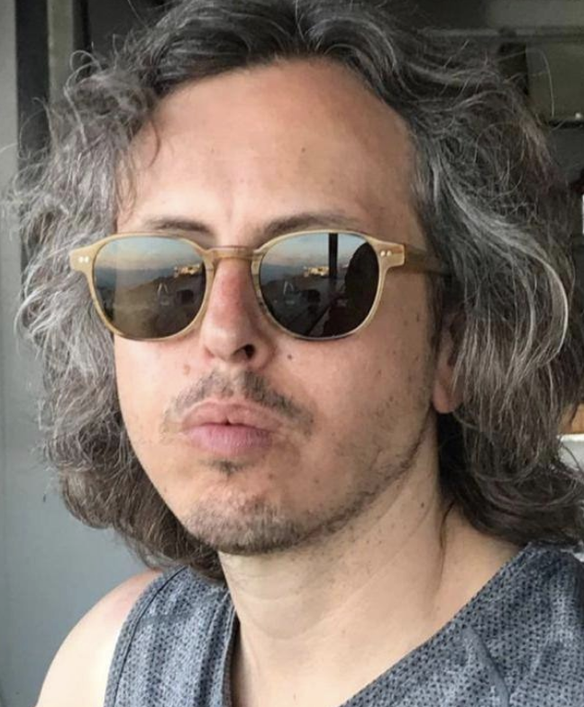
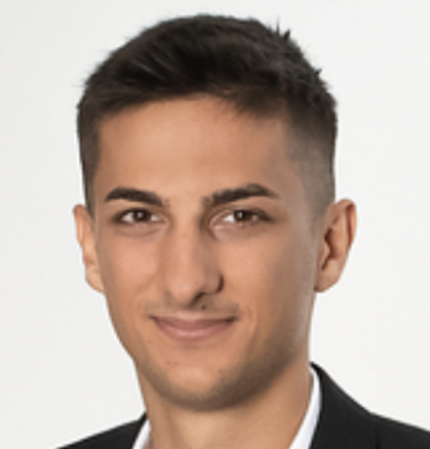
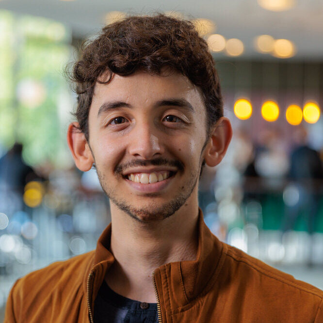
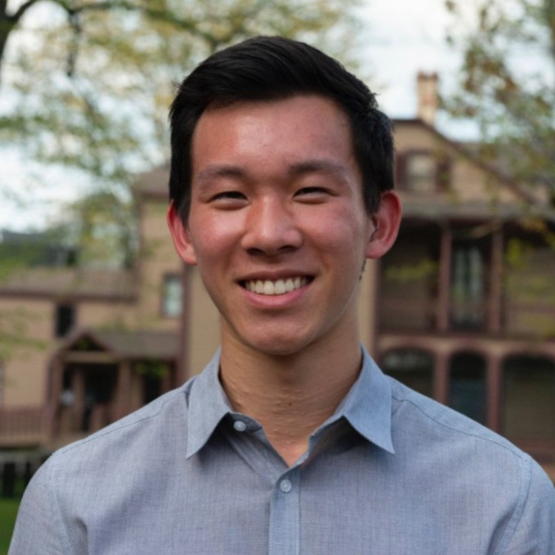
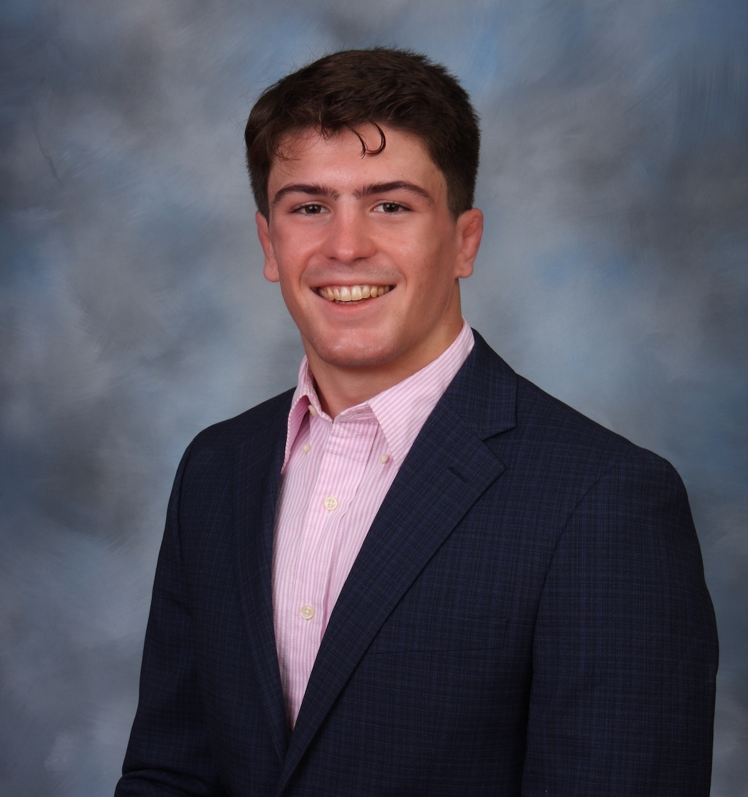
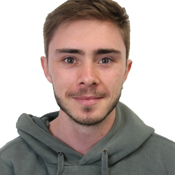

### Oiwi Parker Jones
> Principal Investigator

 

Oiwi leads the Parker Jones Neural Processing Lab (PNPL) at the University of Oxford. His aim is to build bridges between deep learning and the brain, for example by accelerating the development of Brain Computer Interfaces (BCIs), but also by developing deep learning methods for interpreting brain data and leveraging principles of systems neuroscience to inform machine learning. Oiwi completed a DPhil focused on Natural Language Processing (NLP) for low-resource languages. He further trained as a postdoc in Imaging Neuroscience at UCL and Oxford, and in Applied Artificial Intelligence at the ORI. He was previously a lecturer in Medicine at St Peter's College, Oxford, and is currently Hugh Price Fellow in Computer Science at Jesus College, Oxford.

[Twitter](https://twitter.com/oiwi3000) [Oxford Robotics Institute](https://ori.ox.ac.uk/people/oiwi-parker-jones/) [Jesus College](https://www.jesus.ox.ac.uk/about-jesus-college/our-community/people/dr-oiwi-parker-jones/) [Google Scholar](https://scholar.google.com/citations?hl=en&user=zXJwucQAAAAJ&view_op=list_works&sortby=pubdate)

### Pratik Somaiya
> Software Engineer

 

Pratik joined the Oxford Robotics Institute (ORI) in May 2023 as a Robotics Software Engineer. Before that, he pursued an MSc by Research in Robotics at the Lincoln Centre for Autonomous Systems Research (L-CAS), University of Lincoln, UK. Prior to his Master's, he was a Research Assistant at L-CAS working in agri-robotics. Pratik also spent several years in the industry before joining L-CAS. During that time, he worked on developing robots for warehouse material handling and consumer robots such as vacuum cleaning robots.

[Twitter](https://twitter.com/I_m_PRS) [Personal Website](https://pratiksomaiya.in/)

### Francesco Mantegna
> Postdoctoral Research Fellow

 

Francesco joined PNPL as a Postdoc in 2024 after receiving his PhD in Cognitive Psychology and Neuroscience from NYU under the supervision of David Poeppel. His interests include Brain Computer Interfaces (BCIs), Neurotechnology, and Speech Neuroprosthetics.

### Mats van Es
> Research Associate

 

Mats helps to support a broad range of electrophysiological research in PNPL. He is a Postdoc at Oxford Centre for Human Brain Activity (OHBA) where he works with Mark Woolrich to develop analysis methods for electrophysiology (e.g. EEG, SQUID-MEG, OPM-MEG). Mats received his PhD from the Donders Institute (Radboud University, Netherlands) with Dr. Jan-Mathijs Schoffelen, with work on how neural oscillations affect neural processing and behaviour.

### Ryan Timms
> Research Associate

 

Ryan helps to support MEG research that involves source reconstruction. He received his DPhil from the Oxford Centre for Human Brain Activity (OHBA) under the supervision of Mark Woolrich working on unsupervised time-series machine learning techniques for MEG source reconstruction. From there, he went on to manage the Optically Pumped Magnetometer (OPM) Laboratory at UCL with Gareth Barnes and work as a Data Scientist for the BBC.

### Dulhan Jayalath
> DPhil/PhD Student

 

Dulhan is a DPhil student in the Autonomous Intelligent Machines and Systems (AIMS) CDT. At PNPL, his work focuses on leveraging deep learning to find efficient representations of brain signals for downstream tasks (e.g. phoneme recognition from heard speech brain data). Prior to joining PNPL, he worked on multi-agent RL and reasoning with graph neural networks at the University of Cambridge. Before this, he completed his BSc in Computer Science at the University of Southampton, where he researched computer vision systems for visual navigation. He has worked on large language models at Speechmatics and developing assembly-level machine learning kernels for new hardware at Arm.

[Twitter](https://twitter.com/dulhanjay) [Personal Website](https://dulhanjayalath.com/) [LinkedIn](https://www.linkedin.com/in/dulhan/)

### Gilad D. Landau
> DPhil/PhD Student

 

Gilad is a D.Phil student currently working on decoding semantic content from the brain with AI. He is motivated by the prospect of merging brains with AI to deepen our understanding of both. His academic background is in Philosophy of Cognitive Science, where he applied a multi-disciplinary approach to explore how brains process representations. Prior to joining PNPL he worked as an applied AI researcher, developing industry-first AI systems in several domains and modalities.

### Miran Özdogan
> DPhil/PhD Student

 

Miran's work in PNPL has recently focused on the role of sequence models, such as state space models (e.g. S4 and Mamba) for BCIs. He is also working to establish new benchmarks and standards for neural decoding, in order to quantify and accelerate progress in the field.

### Luisa Kurth
> DPhil/PhD Student

 

My motivation is to help improving people’s lives through AI. Currently, I am mostly interested in the challenges of advancing machine learning for medical image analysis. The CDT in AIMS offers the perfect platform for this journey and I’m excited to connect with anyone sharing my interest. I hold a Bachelor's degree in Psychology from the University of Mannheim and a Master's degree from the University of Oxford's Internet Institute. During my time at Oxford, I participated in cutting-edge research on the societal and ethical aspects of AI. This experience fueled my fascination for machine learning, leading me to pursue a second Master's degree at the University of Tübingen, where I focused on the foundations of deep learning, large language models and explainable AI.  Along the way, I've conducted brain research at the Max-Planck-Institute and worked as a policy researcher at the OECD. Outside of research, I enjoy reading, socializing with friends, and visiting art galleries.

### Yonatan Gideoni
> DPhil/PhD Mini-Project (co-supervised with Yarin Gal and Michael Bronstein)

 

Yonatan is a DPhil student in the AIMS CDT. At PNPL he works on improving model scaling by finding natural representations that span output modalities (EEG, MEG, etc.). He completed a master’s at Cambridge and holds a bachelor’s in physics from the Hebrew University of Jerusalem. He worked along the spectrum from academia to industry, doing machine learning for quantum computing at Qruise and Forschungszentrum Jülich and developing maps for autonomous vehicles at Mobileye. He's passionate about education, happily mentoring MSc students and having been a teacher at the Israeli Arts and Sciences Academy. Before that he mentored robotics teams, reaching international competitions several times. He is funded by the AIMS CDT and a Rhodes scholarship.

[Twitter](https://x.com/YGideoni) [Personal Website](http://yonatan.gideoni.com/) [LinkedIn](https://www.linkedin.com/in/yonatan-gideoni/)

<!-- ### Daniella Ye
> DPhil/PhD Student (co-supervised with Phil Blunsom)



[Twitter](https://twitter.com/DaniellaYezi) [LinkedIn](https://www.linkedin.com/in/daniella-zihuiwen-ye-b7aa46180/) -->

<!-- ### Birtan Demirel
> Research Assistant



Birtan completed his MSc degree in Psychology, Neuroscience and Human Sciences at the University of Pavia, Italy. He also trained at the Neurology Department, University Medical Center Goettingen, Germany, where he used real-time magnetic resonance imaging (MRI) for his Master's research project. He is carrying out research for his DPhil at the University of Oxford with Prof. Kate Watkins in the Department of Experimental Psychology, and Prof. Charlotte Stagg at the Wellcome Centre for Integrative Neuroimaging and MRC BNDU, funded by a grant from the Dominic Barker Trust. Birtan also teaches neurophysiology at undergraduate level as part of a Graduate Development Scholarship from St. Anne's College, Oxford. Birtan is interested in speech-motor impairments and how acute stress physiology, cognitive functions and emotions affect speech production. He uses transcranial alternating current stimulation (tACS) alongside advanced neuroimaging techniques of MRI, functional MRI, and magnetoencephalography (MEG). The results of his studies should inform further neuroimaging studies in stuttering and provide possible therapeutic interventions for people who want to work on their speech fluency.

[Twitter](https://twitter.com/BirtanDemirel) [LinkedIn](https://www.linkedin.com/in/birtan-demirel-98b891a9/) -->

### Brian Liu
> Visiting Student

 

Brian is a junior at Bowdoin College studying abroad in Oxford, majoring in mathematics and computer science and minoring in music. He is interested in intersecting mathematical deductions of music, human processes and decisions, and the natural world with programming, as well as leveraging technology to benefit the common good and uncover truths in capital systems.

[LinkedIn](https://www.linkedin.com/in/brianliu03/)

### Charlotte Gerhaher
> Master's Student

 

Charlotte is an MSc student in Advanced Computer Science at the University of Oxford, with a background in bioinformatics and veterinary medicine. She joined PNPL for her master's thesis to work on brain data synthesis using deep generative models, addressing the scarcity of data augmentation options for brain data. Before embarking on her current studies, she completed a BSc in Bioinformatics at the Technical University of Munich and Ludwig Maximilian University, where she focused on reducing bias in state-of-the-art machine learning models for the classification of thoracic diseases in chest X-rays.

### Jeremy Ridge
> Master's Student

 

Jeremy is a current MSc student in Advanced Computer Science at the University of Oxford, associated with Wolfson College. He is completing his master's dissertation with the PNPL group focusing on deep learning applications for non-invasive neuroimaging data. Before coming to Oxford, he completed his bachelors at the University of Pennsylvania, double majoring in Cognitive Science and Computer Science.

### Pablo Soëtard
> Master's Student

 

Pablo is an MSc student in Mathematics and Foundations of Computer Science at the University of Oxford. At PNPL, his work focuses on studying the mathematical structures that encode speech on the brain, through the use of Selective State Space Models. Prior to joining PNPL, he worked on RL for quantum communication protocols at the National Research Council of Spain, and in the Neurocomputing group at UAM on neural pattern generators for robotics control. During his undergraduate years he studied a BEng in Computer Science and Engineering and another BEng in Telecommunications Engineering at UAM. He has worked on information retrieval systems, computer vision and MLOps for the past 4 summers at Google as a Research Software Engineer.

